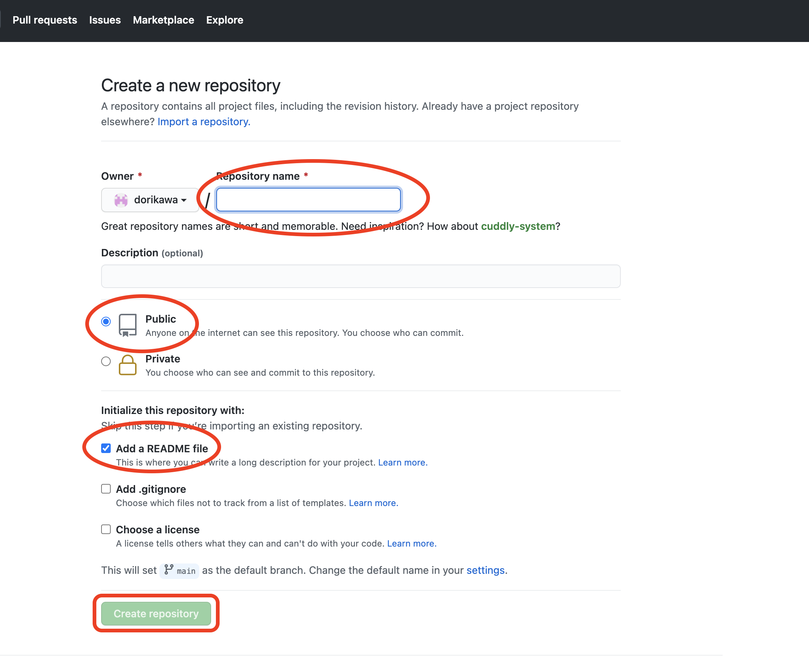

# HP_build

<html>
<head>

<meta charset="UTF-8">
<meta http-equiv="Content-Type" content="text/html; charset=UTF-8">
<meta http-equiv="X-UA-Compatible" content="IE=EmulateIE10" />
<meta http-equiv="X-UA-Compatible" content="IE=edge">

<!--ここから上はお決まりの定型文です-->

<!--ここからが表現の書式などを決めるcssという部分-->

<link href="https://cdnjs.cloudflare.com/ajax/libs/lightbox2/2.7.1/css/lightbox.css" rel="stylesheet">

</head>

<body>

  モバイル端末をお使いの場合は、画面を横向きにすると
  より見やすくご覧頂けます。

    
<!-- ここから上は定型文としてそのままコピペして再利用します —->

<!—- リンクの作り方、例 -->
<!--
<a href="ここにリンク先のURLを入れる" target="_blank" rel="noopener noreferrer">新規タブで開く</a>
-->
<!-- ぱんくずリストの表示例 -->

<a href="https://dorikawa.github.io/20210704_Utsunomiya_swim/">2021年宇都宮市民大会</a>>IT関連情報

<!-- 表題の表示、背景黄色、流れ文字の例 -->
<h1><marquee>!!! QRコードの作り方、他にも色々な方法がありますが、一例です。 !!!</marquee></h1>

<!--

<!-- QRコードの表示例 -->

 アクセス用QRコード

 
<h2>① QRコードを作成したいページのURLをコピーします。 
② 以下のリンク先に飛んで、所定の場所にURLをペースト、できた画像をダウンロードして使用します。</h2>

							       

<a href="https://qr.quel.jp/url.php">QRコード作成リンクhttps://qr.quel.jp/url.php</a>
	
	  
	

<h2>以上、簡単ですが上部のQRコードも同じ方法でできています。 リンク先にはURL以外のものもQRコード化する方法が提供されています。</h2>

         	
<h1><marquee direction="right">!!! 以下、HPの作り方解説 !!!</marquee></h1>
 
<h2>まず初めに、Githubのアカウントを作ります。 
Githubとはネットワーク技術者たちが共同作業をするためのしくみで、2008年に発足、 
2018年にはマイクロソフトに吸収合併されました。2021年時点で無料開放されいてます。 
今回はそのしくみのごく一部の機能を使います。 
以下のリンク先に飛んで、ユーザーネーム、パスワード、メールアドレスなどを入力してアカウントを作成します。</h2>

<a href="https://github.com/">Githubリンクhttps://github.com/</a>

 

 

<h2>サインアップを使うのは最初の一回だけ、二回目以降はサインインを使います。 
アカウントは一度作ってしまえば、以降はユーザーネームとパスワードの入力でサインインできますので、この二つは忘れないようにしましょう。 
ちなみにこのページのアカウント:dorikawa、PassWD:doridori2021ですが、使う際には既にあるリポジトリは温存願います。 
以下は新しいリポジトリ(≒ HP)の作り方です。皆さんが独自のアカウントを立ち上げても同じ作業でHPが作れます。 
参考までに、このページのリポジトリ名は、HP_buildです。URLの中に見えますね。</h2>

<h2>では、新しいリポジトリを作ってみましょう。 
以下のようにクリックして、</h2>

<h2>リポジトリの名前を適当に決めて入力、 
下の二箇所にチェックを入れます。</h2>

<h2><marquee scrollamount="16">〜〜〜〜〜〜〜〜まだまだ、作成中〜〜〜〜〜〜〜〜</marquee></h2>

<h2>最後にそこかしこに出てくるネコですが、 
Githubのメインキャラ「オクトキャット」(タコ・ねこ)です。 
ある領域ではずいぶん流行っていて、グッズも販売されています。 
幸か不幸か、日本でこれを身につけていてもあまり反応はないでしょうね。</h2>

<a href="https://thegithubshop.com/">Githubのグッズ販売リンク</a>

  

<!--

<h2><marquee scrollamount="16">〜〜〜〜〜〜〜〜作成中〜〜〜〜〜〜〜〜</marquee></h2>

-->
                                        
                    

<h6>

 背景奥の白い家は、ユナちゃんの家、場所は秘密です！

</h6>
<!-- フッタ -->
 <footer>
 Copyright 2021/07/08 S.Hada
 </footer>

<!--HPにさまざまなJavaScriptを呼び込むための書式-->

</body>

</html>
